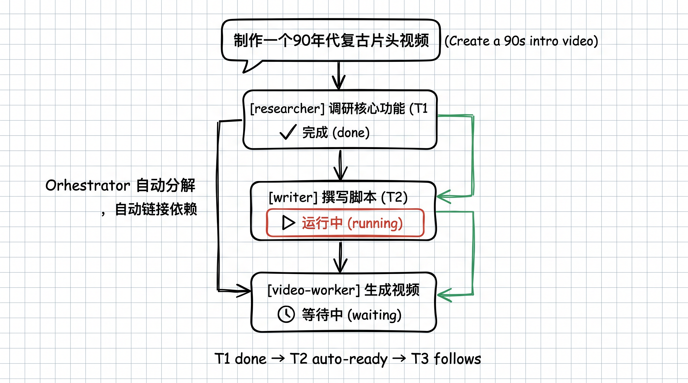
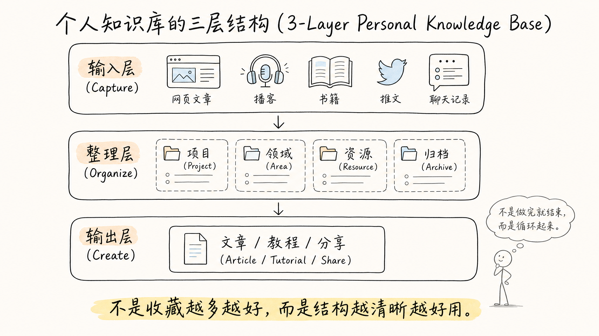
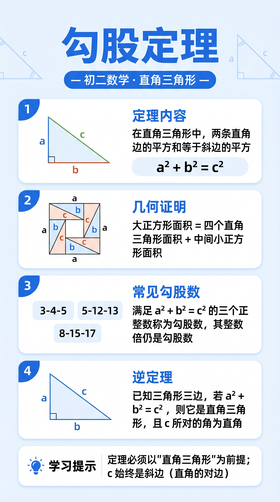

# 林月半子 · AI 配图技能库

公众号「林月半子的 AI 笔记」的 Claude Code 配图技能集合。自动为技术长文生成概念图、流程图、对比图、架构图，让长文不再单调。

## Preview Gallery

`linyuebanzi-inline-diagram` 支持 7 种视觉风格：

| | | | |
|:---:|:---:|:---:|:---:|
|  |  |  |  |
| notebook · 手绘网格笔记本风 | infographic · 专业扁平信息图 | executive-tech · 现代科技商务风 | cozy-handdrawn · 温暖手绘卡片风 |
|  |  |  | |
| tech-doodle · 技术简笔画风 | cartoon-infographic · 卡通信息图风 | whiteboard-sketch · 白板手绘风 | |

## 包含 Skills

### `linyuebanzi-inline-diagram` · 技术长文插图生成

为 3000~8000 字技术长文自动识别插图位置，生成 4-5 张概念图、流程图、对比图、架构图。支持 notebook / infographic / executive-tech / cozy-handdrawn / tech-doodle / cartoon-infographic / whiteboard-sketch 七种视觉风格。

- **输入**: 技术长文 Markdown
- **输出**: 多张 16:9 插图 PNG + 插入位置清单

### `linyuebanzi-edu-infographic` · 学科知识信息图生成

将任意学科知识点转化为竖版教育信息图（9:16）。输入一个知识点名称（如「声现象」「勾股定理」「光合作用」），自动识别学科/年级/章节、拆解核心子概念、生成插图描述并生图。内置**双层学科准确性检查**：生图前按分学科清单自检提示词，生图后读回 PNG 视觉复核（文字/公式/图示），不通过自动重试，确保交付给学生的内容准确。覆盖物理、数学、化学、生物、语文、历史、英语等学科。

- **输入**: 知识点名称（可含学科/年级）
- **输出**: 9:16 竖版信息图 PNG

不同学科示例（初中）：

| | | | |
|:---:|:---:|:---:|:---:|
|  |  |  |  |
| 物理 · 光现象 | 数学 · 勾股定理 | 化学 · 空气的组成 | 生物 · 光合作用 |

### `linyuebanzi-image-gen` · 通用图像生成

支持三种生图 API 的执行层，通过 `--provider` 切换：

| Provider | 参数 | 环境变量 | 模型 |
|---|---|---|---|
| MuleRun | `--provider mulerun`（默认） | `MULERUN_API_KEY` | Nano Banana 2 |
| APImart | `--provider apimart` | `APIMART_API_KEY` | GPT Image 2 |
| Atlas Cloud | `--provider atlascloud` | `ATLASCLOUD_API_KEY` | GPT Image 2 |

支持纯文本生图（generation）和带参考图修图（edit）两种模式，单张和批量执行。被其他 skill 调用的基础设施，不直接面向终端用户。

## 安装

```bash
# 安装全部 skills（推荐）
npx skills add lqshow/linyuebanzi-skills

# 全局安装（所有项目可用）
npx skills add lqshow/linyuebanzi-skills -g

# 只安装某一个 skill
npx skills add lqshow/linyuebanzi-skills -s linyuebanzi-inline-diagram

# 先看看有哪些可安装的
npx skills add lqshow/linyuebanzi-skills --list
```

## 使用

安装后在 Claude Code 中直接对话触发：

```bash
# 插图生成（会先让你选风格）
"帮这篇文章加几张插图，用笔记本手绘风"
"这篇太单调了，配几张图"

# 指定风格
"用温暖手绘卡片风配图"
"来张专业信息图风格的"
```

需要设置对应的环境变量：`MULERUN_API_KEY`、`APIMART_API_KEY` 或 `ATLASCLOUD_API_KEY`。只设一个就会自动检测，不需要额外传参。

## 项目结构

```
linyuebanzi-skills/
├── README.md
├── previews/                                # 预览图
├── skills/
│   ├── linyuebanzi-inline-diagram/          # 插图生成 skill
│   │   ├── SKILL.md                         # 入口定义
│   │   ├── scripts/
│   │   │   └── inject_style.py              # 风格注入脚本
│   │   └── references/                      # 提示词模板、风格定义、案例
│   │       ├── styles/                      # 7 种风格定义
│   │       ├── examples.md                  # 完整案例
│   │       └── prompt_template.md           # 骨架模板
│   ├── linyuebanzi-edu-infographic/         # 学科知识信息图 skill
│   │   ├── SKILL.md                         # 入口定义
│   │   └── references/                      # 提示词模板、插图指引、准确性清单、勘误表
│   │       ├── prompt_template.md           # 骨架模板
│   │       ├── illustration_guide.md        # 各知识点插图指引
│   │       ├── accuracy_checklist.md        # 分学科准确性检查清单
│   │       └── errata.md                    # 知识勘误表
│   └── linyuebanzi-image-gen/               # 通用图像生成 skill
│       ├── SKILL.md                         # 入口定义
│       └── scripts/
│           └── generate.py                  # API 调用脚本
```

## 关于作者

林月半子（LQ），AI 自动化实践者。公众号「林月半子的 AI 笔记」专注于 n8n 和 AI Agent 实战教程。

---

Star & Fork 随意，有问题欢迎提 Issue。
